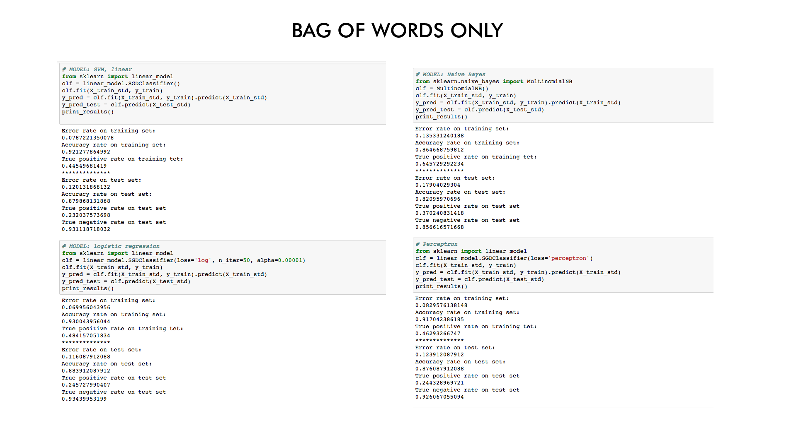
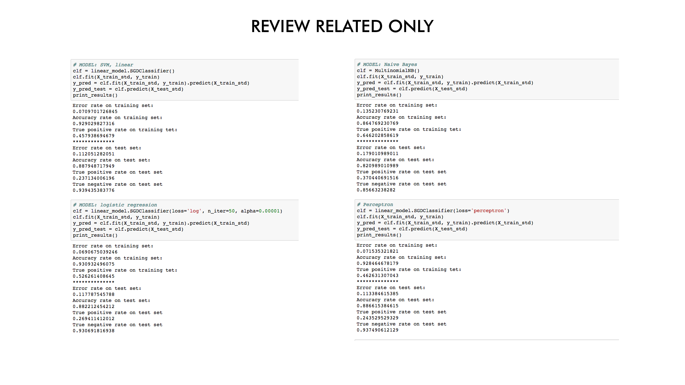
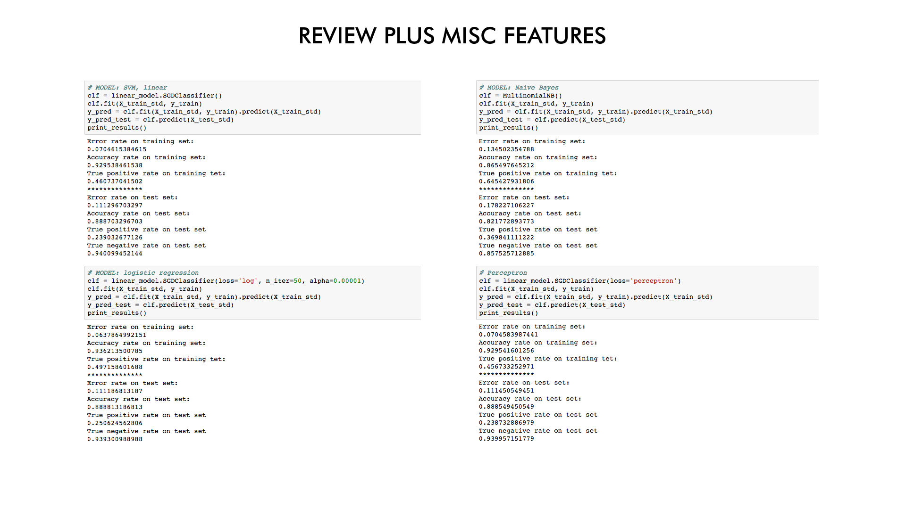

# Assignment 1

##### Classification model using the amazon.csv dataset.
***
##### Notes on the assignment: 
I experimented with adding and subtracting features in order to see how much certain features helped (or hurt) the model. Below are a few of my results. (Plots to come).

Currently working on different methods to extract features from the text other than Bag of Words. Also working on sentiment analysis. The third iteration will include those.

