# Results From version 3

##### Regression models using the mergedSalary2.csv dataset.
***
##### Notes: 
This version eliminates many of the features originally used in version 2.

##### Linear Regression Model:

Intercept: [ 332564.09087774] * Residual sum of squares, test data: 95985615.31 * Residual sum of squares, training data: 58382424.72 * Variance score, test data: 0.74 * Variance score, training data: 0.82 * Coefficients (listed in multReg_linear.txt)

Distribution of prediction error on test data:

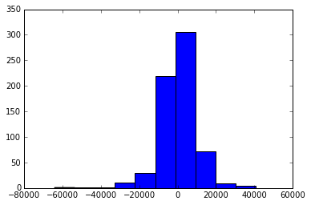

Distribution of prediction error on training data:

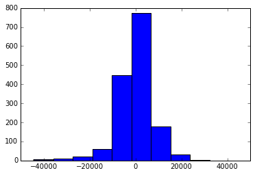

Test Scatter Plot:

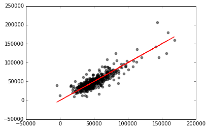

Training Scatter Plot:

##### Ridge Regression Model, alpha=10:

Intercept: [ 46620.12853431] * Residual sum of squares, test data: 81981877.97 * Residual sum of squares, training data: 66466296.52 * Variance score, test data: 0.78 * Variance score, training data: 0.79 * Coefficients (listed in ridge1.txt)

Distribution of prediction error on test data:

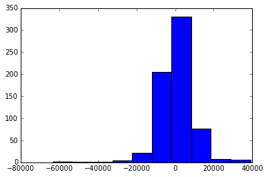

Distribution of prediction error on training data:

Test Scatter Plot:

Training Scatter Plot:

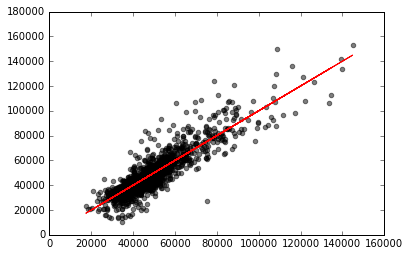

##### Ridge Regression Model, alpha=0.8:

Intercept: [ 97288.29326278] * Residual sum of squares, test data: 83696920.77 * Residual sum of squares, training data: 59909889.69 * Variance score, test data: 0.78 * Variance score, training data: 0.81 * Coefficients (listed in ridge2.txt)

Distribution of prediction error on test data:

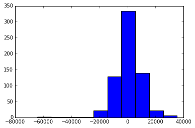

Distribution of prediction error on training data:

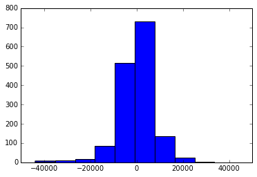

Test Scatter Plot:

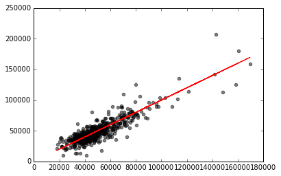

Training Scatter Plot:

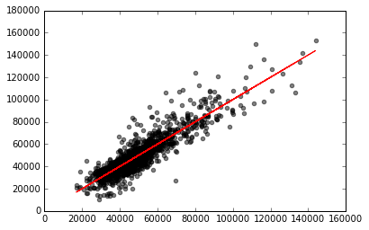

##### Ridge Regression Model, alpha=8:

Intercept: [ 51286.26132695] * Residual sum of squares, test data: 81590462.41 * Residual sum of squares, training data: 65457224.27 * Variance score, test data: 0.78 * Variance score, training data: 0.80 * Coefficients (listed in ridge3.txt)

Distribution of prediction error on test data:

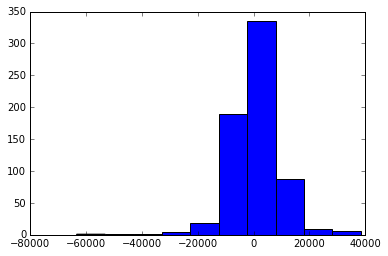

Distribution of prediction error on training data:

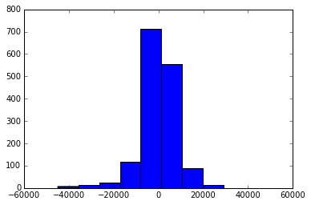

Test Scatter Plot:

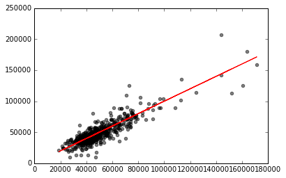

Training Scatter Plot:

