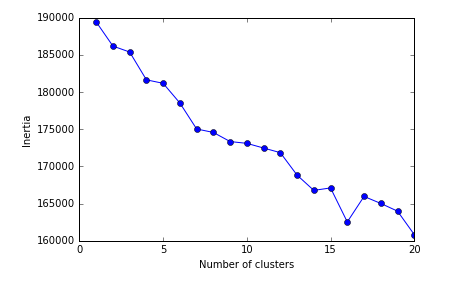

# Assignment 3

##### Clustering model using the amazon.csv dataset.
***
##### Notes on the assignment: 
At this point, choosing the correct K for K Means is a guess. I attempted to use the elbow graph to make educated guesses, but they always resulted in largely uneven cluster formations. Examples of these can be seen below, although they were not helpful.

I settled on 50 clusters in the latest version.
The sample output can be viewed in the txt file. 

The size of the clusters in each cluster index:

Random elbow / inertia graphs with varied cluster sizes:

To Do:
1. Try to even out the last cluster.
2. Finish other graphs, such as the silhouette plot
3. Implement f(k) function for k selection 

